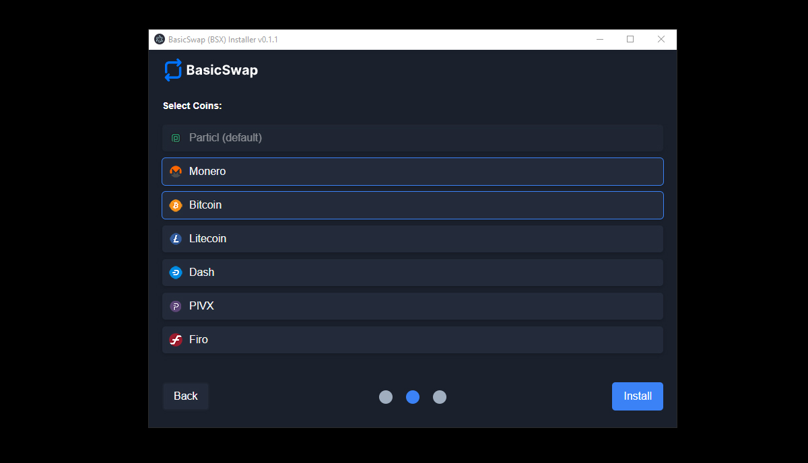

# BasicSwap (BSX) Installer

Introducing BasicSwap (BSX) - A User-Friendly Installer for Linux, OSX, WIN.

Are you looking for a hassle-free way to install [BasicSwap](https://basicswapdex.com) (BSX) without having to use the command-line interface (CLI)? We've got you covered! With our user-friendly installer, you can easily set up BasicSwap on your computer, even if you're not a CLI enthusiast/non-technical. 

# WIP Todo:
1. Comprehensive Testing across Multiple Platforms
2. Fix APP Icons (win/osx/linux)
3. Code Optimization
4. Upgraded Functionality
5. Enhanced Style for Error and Confirmation Pop-ups:
6. Finalize preparations for release.
