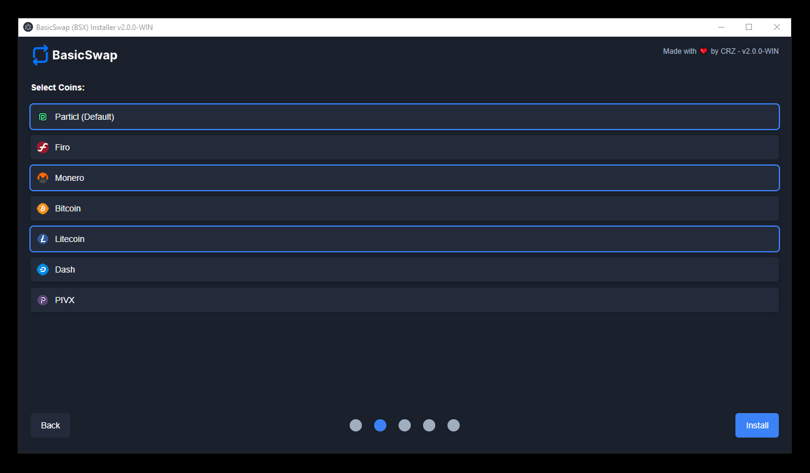

# BasicSwap (BSX) Installer (WIN 10/11)

## Table of Contents

- [Introduction](#introduction)
- [Supported Coins](#supported-coins)
- [Roadmap](#roadmap)
- [Installation Guide](#installation-guide-for-nodejs-npm-yarn-and-basicswap-installer-build)
  - [Installing Node.js and npm](#installing-nodejs-and-npm)
  - [Installing Yarn](#installing-yarn)
  - [Building the basicswap-installer for Windows](#building-the-basicswap-installer-for-windows)
- [BasicSwap DEX Operations and Commands](#basicSwap-dex-operations-and-commands)
- [Support the Project](#support-the-project)

## Introduction

Introducing the BasicSwap DEX installer — a user-friendly graphical installation wizard for WIN 10/11.

If you're looking to install [BasicSwap](https://basicswapdex.com) (BSX) without having to navigate the intricacies of the command-line interface (CLI), this graphical installer is made specifically for you! Simply download it and follow the on-screen instructions; you'll be ready to go in just a few minutes! 

⚠️ **Note**: You can either use the pre-compiled .exe file available in the "release" section, or compile and build from the source code yourself.

⚠️ **Note**: Always ensure that you run the .exe file with administrative privileges to ensure proper functionality.

## Supported Coins 

| Coin      | Current Status            |
|:---------:|:-------------------------:|
| Particl (Default) | ✅ Supported |
| Monero    | ✅ Supported               |
| Bitcoin   | ✅ Supported               |
| Firo      | ✅ Supported            |
| Dash      | ✅ Supported               |
| Litecoin (+MWEB)  | ✅ Supported               |
| Pivx      | ✅ Supported               |

## Roadmap

1. Release versions for OSX and Linux distributions (WIP)

## Installation Guide for Node.js, npm, Yarn, and basicswap-installer Build

### Table of Contents

- [Installing Node.js and npm](#installing-nodejs-and-npm)
- [Installing Yarn](#installing-yarn)
- [Building the basicswap-installer for Windows](#building-the-basicswap-installer-for-windows)

### Installing Node.js and npm

1. **Visit the Node.js Downloads Page**:
   - Navigate to [Node.js Downloads](https://nodejs.org/en/download/).

2. **Select the Appropriate Version**:
   - Choose the **LTS (Long Term Support)** version for stability, or the Current Version if you're more advanced.
   - Download the installer.

3. **Run the Installer**:
   - Launch the downloaded installer.
   - Follow the setup instructions, ensuring npm is also installed.
   - Finish the installation.

4. **Verify the Installation**:
   - Open your terminal or command prompt.
   - Check Node.js with: 
     ```bash
     node -v
     ```
   - Confirm npm with:
     ```bash
     npm -v
     ```

### Installing Yarn

1. **Using npm**:
   - With npm now installed, use it to globally install Yarn:
     ```bash
     npm install -g yarn
     ```

2. **For Windows Users**:
   - If you're using **Chocolatey**, install Yarn with:
     ```bash
     choco install yarn
     ```

4. **Verify Yarn Installation**:
   - Verify Yarn's installation:
     ```bash
     yarn --version
     ```

### Building the basicswap-installer for Windows

1. **Navigate to the Project Directory**:
   - `cd path_to_your_project_directory` (e.g., `cd basicswap-Installation-GUI\electron-gui`)

2. **Install Dependencies**:
   - Run the following to install required project dependencies:
     ```bash
     yarn install
     ```

3. **Build the Windows Release**:
   - Execute the provided script to build the Windows version:
     ```bash
     yarn run package-win
     ```
   - Once built, the application will be available in the `release-builds` folder with versions for both 32-bit (ia32) and 64-bit (x64) architectures.

4. **Testing Without Building**:
   - If you wish to test the application without packaging:
     ```bash
     yarn start
     ```

## BasicSwap DEX Operations and Commands:

1. **Shutting Down BSX**:
   - Press keys: CTRL+C
   - Alternatively, in the BasicSwap BSX GUI, select 'Shutdown' from the menu.

2. **Accessing BasicSwap BSX GUI in the Browser:**:
   - Use the following address:
     ```bash
     http://127.0.0.1:12700
     ```

3. **Upgrading Coins Core**:
   - (Run these commands in the Command Prompt CMD with administrative rights):
     ```bash
     basicswap-prepare --datadir="C:\yourbasicswapfolder\coindata" --preparebinonly --withcoins=coinname
     ```

4. **Adding Other Coins**:
   - (Run these commands in the Command Prompt CMD with administrative rights):
   - For Bitcoin:
     ```bash
     basicswap-prepare --usebtcfastsync --datadir="C:\yourbasicswapfolder\coindata" --addcoin=bitcoin,coinname
     ```
   - If Bitcoin is not selected:
     ```bash
     basicswap-prepare --datadir="C:\yourbasicswapfolder\coindata" --addcoin=coinname,coinname
     ```

5. **Updating BasicSwap BSX**:
   - (Run these commands in the Command Prompt CMD with administrative rights):
     ```bash
     cd C:\yourbasicswapfolder\basicswap
     git pull
     pip3 install .
     cd C:\yourbasicswapfolder\
     basicswap-run --datadir="C:\yourbasicswapfolder\coindata"

     ```
**Note**: Replace placeholders such as coinname or yourbasicswapfolder with actual values before executing commands. Supported Coins: particl, bitcoin, monero, dash, pivx, litecoin

⚠️ **Note**: Virus scanners may mistakenly identify monerod (Monero - XMR) as malware.


## Support the Project

We're dedicated to building tools to improve your financial privacy. If you find the BasicSwap Installer useful and would like to support our ongoing initiatives, consider donating to our project. Every contribution, regardless of its size, enables us to keep on going.

### Donation Addresses:

**Particl (PART) Stealth Address:**  
`SPH2gToV6KS9ykKRkFoxH4XHKfYUtY9RBzUR3sGLamHsd9fnoKu9deDJZ3mR54CRzdcbBhi1jZjAtZX2cacieVTHzP5hvdmo3YYHRZ`

**Monero (XMR) Address:**  
`48f89P6duCybsKrSBv8Wq3fW7k6tGH4t2atfH3ueeujkjdkwSJyC6HKXbhdq179VjoeNXjUCMrpG3731eawSFEVJL9d62fk`

**Bitcoin (BTC) Address:**  
`bc1qkqcafr95p6dh0x3d7z5kjm7vw3q42mqhm7n3fz`

**Litecoin (LTC-MWEB) Address:**  
`ltcmweb1qqdy4u664glaky29lqlekwzk6t6gejs3huush68jtvrdtgd802d8ywqn8y6auz0yjw9h7nmgz276am9zpql5qk4xg8f6g5g8q70p89j5z8uhehjvn`

**Litecoin (LTC) Address:**  
`ltc1qsre9qhqg9na6mxqsrmq7vvlq58swp6kxjmg4d3`

**PIVX (PIVX) Address:**  
`DTtCWz5V1sWtGa8xQa1M4fkDCffgxCTSqX`

**FIRO (FIRO) Address:**  
`aBdMWuehMpFgisvHs5H9phd9XXtAF9XAbP`

**Dash (DASH) Address:**  
`Xj3Rv5REJB4tujT7vVPzFqUMKj5pnaaQwh`

🙌 Your support is greatly appreciated!
